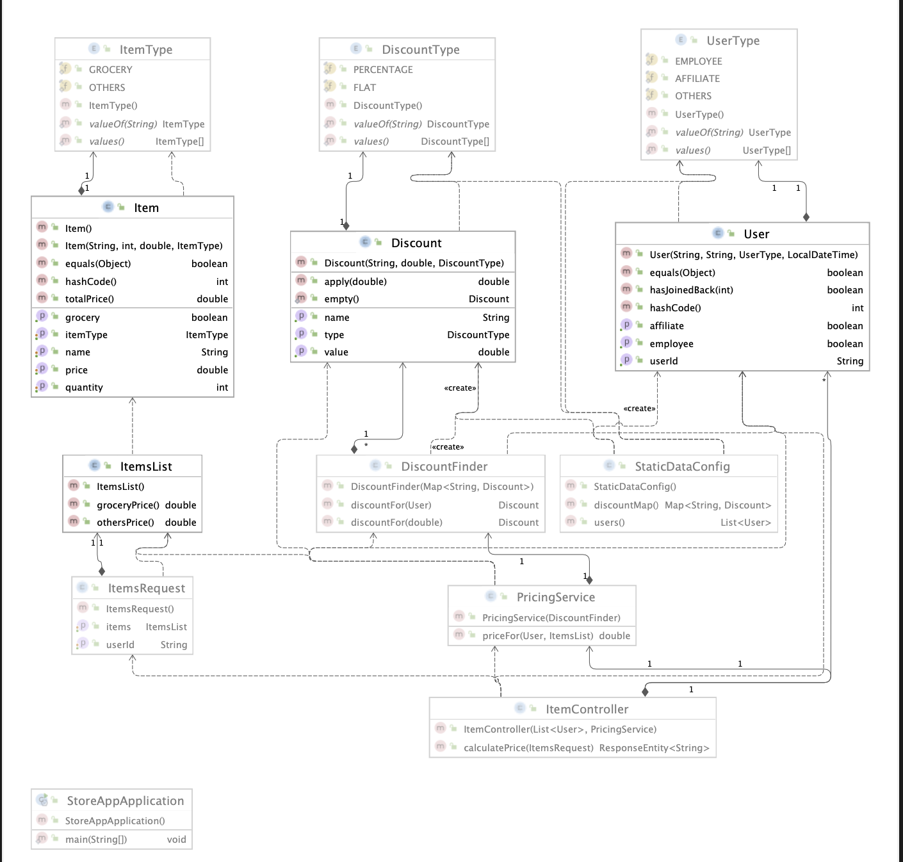

# Problem Statement

On a retail website, the following discounts apply:
1. If the user is an employee of the store, he gets a 30% discount
2. If the user is an affiliate of the store, he gets a 10% discount
3. If the user has been a customer for over 2 years, he gets a 5% discount.
4. For every $100 on the bill, there would be a $ 5 discount (e.g. for $ 990, you get $ 45
   as a discount).
5. The percentage based discounts does not apply on groceries.
6. A user can get only one type of the percentage based discounts on a bill.

## UML Diagram

The UML Diagram is given in UML.png


## Approach

1. The application is running on port 8082 and the sample request response has been attached.
2. Static data setup has been configured and being used.
3. To read through the code, one can start from the tests. The code is written mostly following the test first apporach
4. The commit log consists of the small commits used in this code.

## Sample Request-Response

URL: POST http://localhost:8082/items/price

Content-Type: application/json
```bash
{
  "userId": "USER001",
  "items": [
    {
      "name": "item1",
      "price": 10.0,
      "quantity": 2,
      "itemType": "GROCERY"
    },
    {
      "name": "item2",
      "price": 20.0,
      "quantity": 2,
      "itemType": "OTHERS"
    }
  ]
}
```
Response

```bash
Price :54.0
```